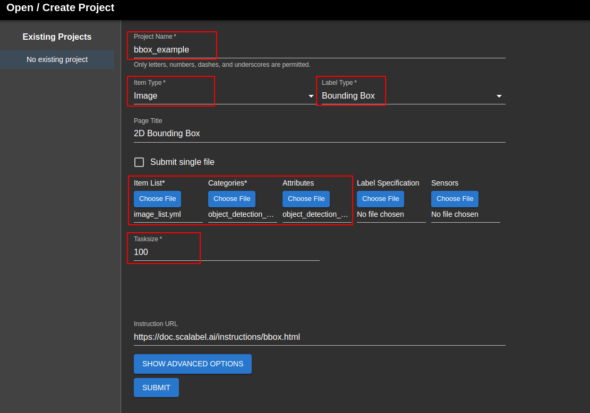

# Scalabel使用说明

本工程提供了scalabel的docker安装方式，可以直接使用docker-compose进行安装。[官方文档](https://doc.scalabel.ai/setup.html)

## Usage

### Installation
```bash
# 1. pull the image
docker pull scalabel/www

# 2. create the container
cd scalabel
docker-compose up -d
```

### Create a project
> **Note**
>
> 在使用scalabel之前，需要先创建一个项目并选择相应的配置文件。官方支持两种配置文件提供方式：1. 提供一个配置文件，其包含所有内容；2. 每一项内容都提供一个配置文件。本工程采用**第二种方式**，每一项内容都提供一个配置文件，方便用户进行修改。下面以标注bbox为例，介绍如何使用scalabel。

1. 访问 [http://localhost:8686/create](http://localhost:8686/create) 创建一个工程.
2. 进行一些配置，如下图所示,其中
    - **Project Name**: 项目名称
    - **Item Type**: 要标注的文件类型，本工程选择`Image`类型
    - **Label Type**: 要标注的内容类型，本工程选择`Bounding Box`类型
    - **Item List**: 要标注的文件列表，本工程选择本工程示例的Items目录下的`image_list.yml`文件
    - **Categories**: 用于配置标注类别的文件，本工程选择本工程示例的categories目录下的`object_detection_categories.yml`文件
    - **Attributes**: 用于配置标注属性的文件，本工程选择本工程示例的attributes目录下的`object_detection_attributes.yml`文件
    - **Tasksize**: 用于配置每个任务的大小，本工程选择`100`，即每个任务标注100张图像，例如输入的图像数为1000张，则分配出10个任务，每个任务标注100张图像。这样做的好处是可以将标注任务分配给多个人，每个人标注100张图像，最后将标注结果合并即可。
3. 开始标注




更具体的使用说明可以参考[docs中的文档](./docs)

